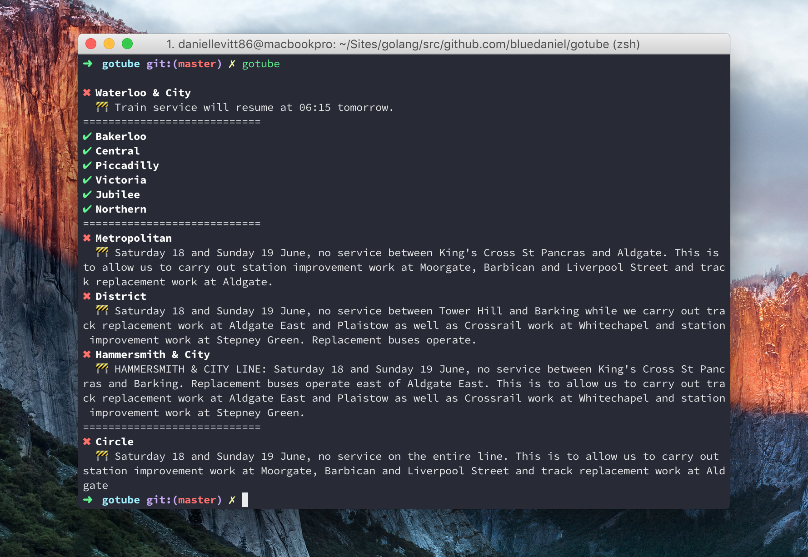
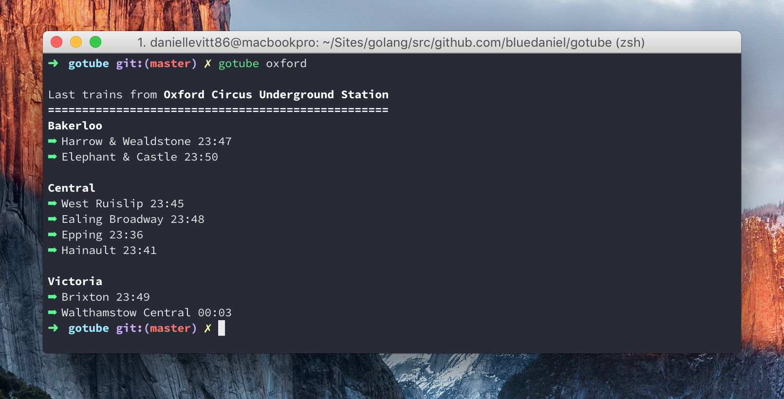

## GoTube

> :metro: A terminal app for checking TFL tube status and last trains, written in Go

```console
// Show the status of all tube lines
$ gotube
```



```console
// Show the last trains for a particular station
$ gotube kings cross
```



### Install

To install, use `go get`:

```console
$ go get -d github.com/bluedaniel/gotube
```
